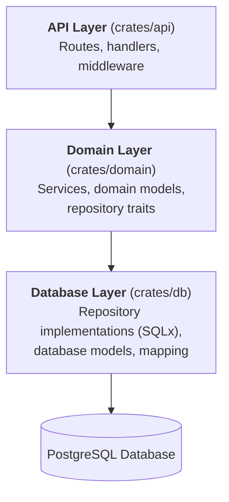

# ADR 0003: Repository Pattern with Trait-Based Abstraction

## Status

Accepted

## Context

We needed to design the data access layer for the backend to:

- Abstract database operations from business logic
- Enable testability with mock repositories
- Support potential future database changes
- Maintain clean separation of concerns
- Leverage Rust's type system for compile-time guarantees

Options considered:

1. **Active Record**: Domain models with built-in database operations (like Diesel ORM)
2. **Repository Pattern with Traits**: Domain defines interfaces, db crate implements
3. **Direct SQLx in Services**: Services make direct database calls
4. **Generic Repository**: Single generic repository for all entities

## Decision

We will use the **Repository Pattern with Trait-Based Abstraction**.

Architecture:



## Decision Details

### Repository Traits (Domain Layer)

Define repository interfaces as traits in the domain layer:

```rust
// domain/src/repositories/team_repository.rs
#[async_trait]
pub trait TeamRepository: Send + Sync {
    async fn create(&self, team: NewTeam) -> Result<Team>;
    async fn get_by_id(&self, id: Uuid) -> Result<Option<Team>>;
    async fn list(&self) -> Result<Vec<Team>>;
    async fn update(&self, team: Team) -> Result<Team>;
    async fn delete(&self, id: Uuid) -> Result<()>;
}
```

### Repository Implementations (Database Layer)

Implement traits using SQLx in the db crate:

```rust
// db/src/repositories/team_repository.rs
pub struct TeamRepositoryImpl {
    pool: PgPool,
}

#[async_trait]
impl TeamRepository for TeamRepositoryImpl {
    async fn create(&self, team: NewTeam) -> Result<Team> {
        // SQLx implementation
    }
    // ... other methods
}
```

### Services Depend on Traits

Services are injected with repository traits, not concrete implementations:

```rust
pub struct DraftService<TR: TeamRepository, PR: PlayerRepository> {
    team_repo: Arc<TR>,
    player_repo: Arc<PR>,
}
```

## Consequences

### Positive

- **Testability**: Services can be tested with mock repositories implementing the same traits
- **Separation of Concerns**: Domain logic is independent of database implementation
- **Type Safety**: Rust's trait system ensures implementations match interfaces
- **Flexibility**: Can swap database implementations without changing domain layer
- **Clear Contracts**: Repository traits document the data access API
- **Dependency Direction**: Dependencies point inward (db depends on domain, not vice versa)
- **Compile-Time Verification**: Missing methods or wrong signatures are caught at compile time

### Negative

- **Boilerplate**: More code than direct database access (traits + implementations)
- **Complexity**: Three layers (domain, service, repository) vs direct access
- **Mapping Required**: Often need to map between domain models and database models
- **Async Trait**: Requires `async-trait` crate for async methods in traits (until Rust has native async traits)
- **Arc Wrapping**: Repository instances often need Arc for shared ownership

### Neutral

- **Learning Curve**: Developers need to understand the repository pattern
- **File Count**: More files due to separation (traits, implementations, models)
- **Navigation**: IDE support helps, but jumping between trait and implementation requires extra steps

## Implementation Guidelines

### Repository Trait Naming

- Traits: `TeamRepository`, `PlayerRepository`
- Implementations: `TeamRepositoryImpl`, `PlayerRepositoryImpl`
- Located: Traits in `domain/src/repositories/`, Implementations in `db/src/repositories/`

### Error Handling

- Repositories return `Result<T>` where errors are domain-level errors
- Database-specific errors are mapped to domain errors in the repository implementation
- This prevents SQLx error types from leaking into the domain layer

### Model Mapping

- **Domain Models**: Represent business concepts (in `domain/src/models/`)
- **Database Models**: Represent database tables (in `db/src/models/`)
- Repositories handle mapping between the two

Example:

```rust
// Domain model
pub struct Team {
    pub id: Uuid,
    pub city: String,
    pub name: String,
}

// Database model
struct TeamDb {
    id: Uuid,
    city: String,
    name: String,
    created_at: DateTime<Utc>,
    updated_at: DateTime<Utc>,
}

impl From<TeamDb> for Team {
    fn from(db: TeamDb) -> Self {
        Team {
            id: db.id,
            city: db.city,
            name: db.name,
        }
    }
}
```

### Testing with Mocks

Use `mockall` crate to generate mocks from traits:

```rust
#[cfg(test)]
mod tests {
    use super::*;
    use mockall::mock;

    mock! {
        TeamRepo {}

        #[async_trait]
        impl TeamRepository for TeamRepo {
            async fn get_by_id(&self, id: Uuid) -> Result<Option<Team>>;
            // ... other methods
        }
    }

    #[tokio::test]
    async fn test_service_with_mock() {
        let mut mock_repo = MockTeamRepo::new();
        mock_repo
            .expect_get_by_id()
            .returning(|_| Ok(Some(Team { /* ... */ })));

        let service = DraftService::new(Arc::new(mock_repo));
        // Test service logic without database
    }
}
```

## Alternatives Considered

### Active Record Pattern

**Pros**: Less boilerplate, models have database methods directly
**Cons**: Domain models depend on database, harder to test, tight coupling
**Rejected**: Violates separation of concerns, makes testing harder

### Direct SQLx in Services

**Pros**: Simple, less code, fewer layers
**Cons**: Services tightly coupled to SQLx, impossible to mock, hard to test
**Rejected**: Testability is critical for business logic

### Generic Repository

**Pros**: Single repository handles all entities, very DRY
**Cons**: Loss of type safety, all entities must follow same pattern, less flexible
**Rejected**: NFL draft domain has complex entity relationships requiring specific queries

## References

- [Repository Pattern](https://martinfowler.com/eaaCatalog/repository.html)
- [Dependency Inversion Principle](https://en.wikipedia.org/wiki/Dependency_inversion_principle)
- [async-trait crate](https://docs.rs/async-trait/)
- [mockall crate](https://docs.rs/mockall/)
